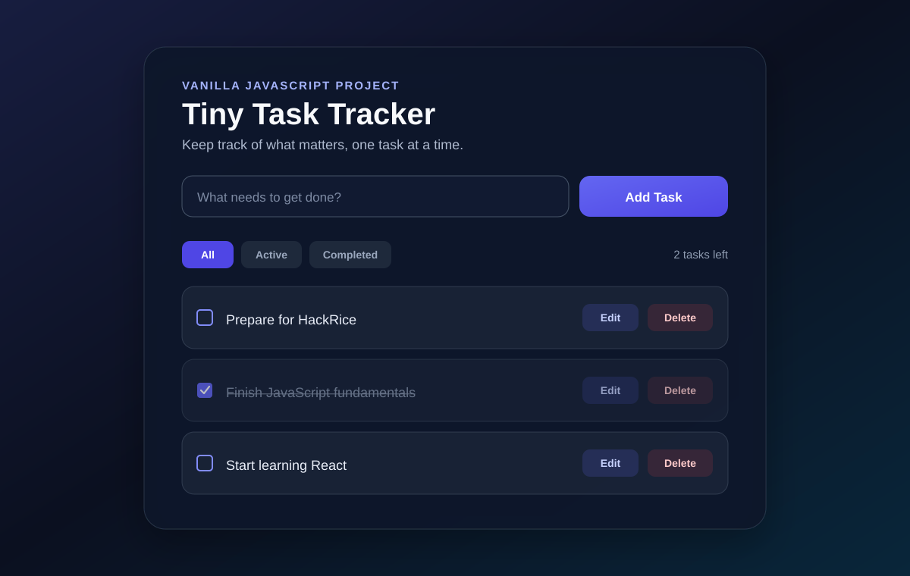

# Tiny Task Tracker

A responsive task-tracking web app built with vanilla JavaScript, HTML, and CSS. I created this project to practice DOM manipulation, application state, browser persistence, event-driven UI behavior, and accessible front-end development without relying on a framework.



## Live Demo

GitHub Pages deployment is configured for this repository:

**https://omar-lyzkru.github.io/tiny-task-tracker/**

> If the site is not live yet, GitHub Pages needs to be enabled once in the repository settings with **GitHub Actions** selected as the deployment source.

## Features

- Add tasks with the button or by pressing **Enter**
- Prevent empty tasks from being created
- Mark tasks as complete or active
- Edit existing tasks inline
- Save edits with **Enter** or cancel with **Escape**
- Delete individual tasks
- Filter between **All**, **Active**, and **Completed** tasks
- Display the number of active tasks remaining
- Persist tasks and completion state with `localStorage`
- Restore saved tasks after refreshing or reopening the page
- Responsive layout for desktop and mobile screens
- Accessible labels, keyboard interactions, focus states, and live status announcements

## Technologies

- HTML5
- CSS3
- JavaScript
- DOM API
- `localStorage`
- JSON serialization with `JSON.stringify()` and `JSON.parse()`
- Git and GitHub
- GitHub Actions / GitHub Pages

## What I Practiced

This project helped me move beyond JavaScript syntax and work with the relationship between **application state**, **persistent storage**, and the **rendered UI**.

Key concepts used include:

- DOM selection, creation, replacement, and removal
- Event listeners and callback functions
- Arrays and objects as application state
- Array methods including `forEach()`, `filter()`, `indexOf()`, and `splice()`
- State synchronization between JavaScript, the DOM, and `localStorage`
- Filtering derived UI from application state
- Reusable rendering functions instead of duplicated DOM code
- Form submission and keyboard events
- Responsive CSS and mobile layouts
- Semantic HTML and accessibility attributes
- Defensive handling of malformed persisted data
- Debugging browser and JavaScript errors

## Project Structure

```text
Tiny Task Tracker/
├── .github/
│   └── workflows/
│       └── pages.yml
├── assets/
│   └── tiny-task-tracker-preview.svg
├── index.html
├── script.js
└── styles.css
```

## How It Works

Tasks are stored as JavaScript objects:

```js
{
    text: "Start learning React",
    completed: false
}
```

The application keeps an in-memory `tasks` array as its main state. Every meaningful change updates that state, saves it to `localStorage`, and re-renders the appropriate UI.

```text
User action
    ↓
Update tasks[]
    ↓
JSON.stringify()
    ↓
localStorage
    ↓
renderTasks()
    ↓
Updated DOM
```

## Running Locally

Clone the repository:

```bash
git clone https://github.com/Omar-Lyzkru/tiny-task-tracker.git
```

Open the project folder and launch `index.html` in a browser, or use a local development server such as the VS Code Live Server extension.

## Author

**Omar Aguilar**  
Computer Science student at the University of Houston

- GitHub: [Omar-Lyzkru](https://github.com/Omar-Lyzkru)
